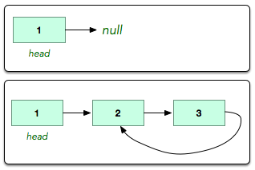

# Linked List problems

Below are the two problems for this section, this problems are classic problems that are often presented in interviews and as warming for more complex problems where the main problem is not implement a list.

## General notes:

To give a litle more complexity and to make this more interesting, you have prohibited to use any list implementation on most popular languages, this means, that you have to create your own list implementation, for example, in JavaScript this could be:

```javascript
function ListNode(data){
  this.data = data;
  this.next = null;
}
//...
//Example of use:
var head = new ListNode(5);
var n = new ListNode(10);
head.next = n;
```

Also consider that `data` on your nodes isn't important, because it should work with any kind of data, examples are often presented with integers.

## Problem 1: Cycle

A linked list is said to contain a *cycle* if any node is visited more than once while traversing the list. 

Create a function that has one parameter: a pointer to a *Node* object named _head_ that points to the head of a linked list. Your function must return a _boolean_ denoting whether or not there is a cycle in the list. If there *is* a cycle, return *true*; otherwise, return *false*.

### Note:

Given the nature of this problem, some manual creation of the test cases has to be done... sorry for that.

### Constrains:

* The list could be empty, meaning that the _head_ will be _null_
* 0 <= List size <= 100

### Sample Input

The following linked lists are passed as arguments to your function:    



### Sample output

`false`

`true`


## Palindrome

Given an input, determine if the input represents a _palindrome_.

### Explanation on palindrome

A palindrome is a word, phrase, number, or other sequence of characters which reads the same backward or forward.

### Example input

`1 2 3 4 3 2 1`
`1 2 3 4 5 6`
### Example output

`true`
`false`


